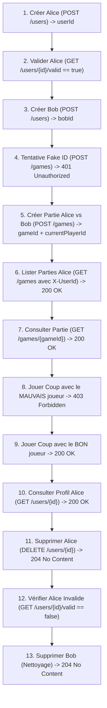

# 📚 Cours — Itération 4 : Architecture Microservices, RestClient & Tests Automatisés avec Bruno

Bienvenue dans le guide complet de l'**Itération 4** ! 

Cette itération marque le passage d'une application monolithique à une architecture distribuée composée de deux microservices Spring Boot indépendants communicant via HTTP, protégés par un contrôle d'accès personnalisé et validés par une suite de tests automatisée sous **Bruno**.

---

## 📑 Sommaire
1. [Architecture Globale & Philosophie](#1-architecture-globale--philosophie)
2. [Microservice 1 : `user-service` (Port 8081)](#2-microservice-1--user-service-port-8081)
3. [Microservice 2 : `square_games` & Communication Inter-Services (Port 8080)](#3-microservice-2--square_games--communication-inter-services-port-8080)
4. [Sécurité & Règles Métier : 401 vs 403](#4-sécurité--règles-métier--401-vs-403)
5. [Tests d'API Automatisés avec Bruno](#5-tests-dapi-automatisés-avec-bruno)
6. [Guide d'Exécution Pas-à-Pas](#6-guide-dexécution-pas-à-pas)

---

## 1. Architecture Globale & Philosophie

Dans cette itération, nous séparons les responsabilités :
- **`user-service`** : Gestion des comptes utilisateurs (création, consultation, suppression, vérification de validité).
- **`square_games`** : Moteur de jeux de plateau (création de parties, gestion des tours, déplacement des pions).

```mermaid
flowchart LR
    Client([Client HTTP / Bruno]) -->|X-UserId + Requetes Jeux| SG[square_games : 8080]
    Client -->|CRUD Utilisateurs| US[user-service : 8081]
    SG -->|GET /users/{id}/valid via RestClient| US
    SG --> DB1[(PostgreSQL : square_games)]
    US --> DB2[(PostgreSQL : users_db)]
```

### Principes Clés
1. **Isolation des données** : Chaque service possède sa propre base de données dédiée (`square_games` et `users_db`), hébergées sur le même serveur PostgreSQL mais complètement cloisonnées.
2. **Ports distincts** :
   - `square_games` tourne sur `http://localhost:8080`.
   - `user-service` tourne sur `http://localhost:8081`.
3. **Communication synchrone HTTP** : `square_games` valide l'existence des joueurs auprès de `user-service` grâce à `RestClient` avant d'autoriser toute action.

---

## 2. Microservice 1 : `user-service` (Port 8081)

### Configuration (`application.properties`)
```properties
server.port=8081
spring.application.name=user-service

spring.datasource.url=jdbc:postgresql://localhost:5432/users_db
spring.datasource.username=postgres
spring.datasource.password=postgres
spring.jpa.hibernate.ddl-auto=update
```

### Endpoints Exposés
| Méthode | Route | Description | Statut Succès |
| :--- | :--- | :--- | :--- |
| `POST` | `/users` | Crée un nouvel utilisateur (`username`, `email`) | `201 Created` |
| `GET` | `/users/{id}` | Récupère le profil par identifiant UUID | `200 OK` |
| `DELETE` | `/users/{id}` | Supprime l'utilisateur | `204 No Content` |
| `GET` | `/users/{id}/valid` | Vérifie si l'identifiant existe (`true` / `false`) | `200 OK` |

### Point Pédagogique : La Route `/users/{id}/valid`
Cette route légère renvoie simplement un booléen en texte brut ou JSON (`true` ou `false`). Elle évite de transférer l'objet utilisateur complet sur le réseau lorsque l'autre service a seulement besoin de vérifier son existence.

---

## 3. Microservice 2 : `square_games` & Communication Inter-Services (Port 8080)

### Le Client HTTP Moderne : `RestClient`
Introduit avec Spring Boot 3 / Spring Framework 6, `RestClient` offre une API fluide, synchrone et moderne remplaçant le vénérable `RestTemplate`.

#### Déclaration du Bean :
```java
@Configuration
public class UserClientConfig {

    @Bean
    public RestClient userRestClient(@Value("${user.service.url:http://localhost:8081}") String userServiceUrl) {
        return RestClient.builder()
                .baseUrl(userServiceUrl)
                .build();
    }
}
```

#### Service d'Interrogation :
```java
@Service
public class UserValidationClient {

    private final RestClient restClient;

    public UserValidationClient(RestClient restClient) {
        this.restClient = restClient;
    }

    public boolean isUserValid(UUID userId) {
        if (userId == null) return false;
        try {
            Boolean isValid = restClient.get()
                    .uri("/users/{id}/valid", userId)
                    .retrieve()
                    .body(Boolean.class);
            return Boolean.TRUE.equals(isValid);
        } catch (Exception e) {
            return false; // Résilience : si user-service est injoignable ou erreur, l'utilisateur n'est pas validé
        }
    }
}
```

---

## 4. Sécurité & Règles Métier : 401 vs 403

Dans les architectures REST, la distinction entre les codes HTTP 401 et 403 est fondamentale :

| Code HTTP | Libellé | Quand l'utiliser dans notre application ? |
| :--- | :--- | :--- |
| **`401 Unauthorized`** | Non authentifié | L'identifiant `X-UserId` est absent, malformé ou **inconnu** dans `user-service`. Le système ne sait pas qui vous êtes. |
| **`403 Forbidden`** | Non autorisé | L'utilisateur est identifié et reconnu, mais **il n'a pas le droit d'effectuer l'action** (ex: jouer un coup alors que c'est le tour de l'adversaire). |

### Implémentation du Contrôle du Tour de Jeu
Dans `GameController.java` :
```java
@PostMapping("/games/{gameId}/moves")
public ResponseEntity<?> playMove(
        @RequestHeader("X-UserId") UUID userId,
        @PathVariable String gameId,
        @RequestBody CellPosition move) {

    // 1. Authentification
    if (!userValidationClient.isUserValid(userId)) {
        return ResponseEntity.status(HttpStatus.UNAUTHORIZED)
                .body(Map.of("error", "Utilisateur non authentifié ou inconnu."));
    }

    try {
        UUID uuid = UUID.fromString(gameId);
        Game updatedGame = gameService.playMove(uuid, userId, move);
        return ResponseEntity.ok(updatedGame);
    } catch (NotPlayerTurnException e) {
        // 2. Autorisation / Règle Métier
        return ResponseEntity.status(HttpStatus.FORBIDDEN)
                .body(Map.of("error", e.getMessage()));
    }
}
```

---

## 5. Tests d'API Automatisés avec Bruno

La collection est configurée dans le format moderne **Bruno OpenCollection** sous `bruno/Square_Games/` (et automatiquement disponible dans l'application Bruno).

### Les Concepts Utilisés dans Bruno
1. **Environnement dynamique** (`environments/Local.yml`) :
   - `userServiceUrl: http://localhost:8081`
   - `gameServiceUrl: http://localhost:8080`
2. **Scripting Javascript** :
   - `before-request` : Génération d'emails dynamiques avec timestamp (`"alice_" + Date.now() + "@example.com"`) pour garantir l'unicité à chaque lancement du Runner.
   - `after-response` : Extraction et sauvegarde automatique des variables partagées avec `bru.setVar("cle", valeur)`.
   - `tests` : Assertions BDD avec `expect(res.getStatus()).to.equal(...)`.

### Chaînage Complet de la Collection (13 Requêtes)


---

## 6. Guide d'Exécution Pas-à-Pas

### Étape 1 : Démarrer PostgreSQL (Docker)
Vérifiez que le conteneur PostgreSQL est actif :
```bash
docker start square-games-postgres
```

### Étape 2 : Lancer les Deux Applications
Ouvrez deux terminaux :

**Terminal 1 — Service Utilisateurs :**
```bash
cd /home/user/Spring_Formation/user-service
./mvnw spring-boot:run
```
*(Le service démarre sur le port 8081)*

**Terminal 2 — Jeu Square Games :**
```bash
cd /home/user/Spring_Formation/square_games
./mvnw spring-boot:run
```
*(Le service démarre sur le port 8080)*

### Étape 3 : Lancer la Collection dans Bruno
1. Lancez l'application **Bruno**.
2. Ouvrez la collection **Square_Games** (déjà présente dans vos collections ou dans `Documents/bruno/Square_Games`).
3. En haut à droite, sélectionnez l'environnement **`Local`**.
4. Cliquez sur **Runner** (l'icône d'exécution en haut ou clic droit sur la collection > **Run**).
5. Cliquez sur **Run Collection**.
6. Observez l'intégralité des 13 étapes s'exécuter en vert :
   - Création dynamique des comptes,
   - Contrôle d'accès inter-services,
   - Respect strict des tours de jeu,
   - Nettoyage final des données.
