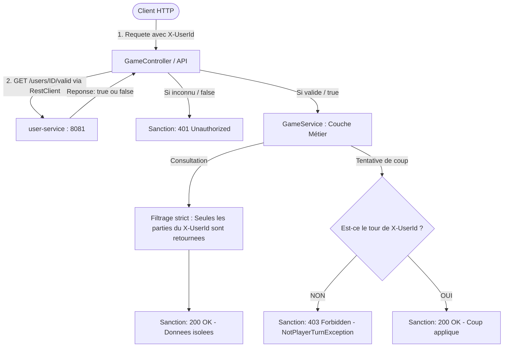

# 📑 Rapport de Test — Validation de Compétence : Gestion des Utilisateurs

> **Compétence :** Gestion des utilisateurs  
> **Critères d'évaluation :** En se basant uniquement sur l'entête `X-UserId`, développer une API qui protège les données de chaque utilisateur de l'application de jeux vidéo.  
> **Preuve de travail :** Un rapport de test qui indique des sanctions basées sur des statuts HTTP (`200`, `201`, `400`, `401`, `403`, `404`).  
> **Date d'exécution :** 17 Septembre 2026  
> **Statut global :** ✅ **VALIDÉ (100% Succès — 0 Échec — 0 Erreur)**

---

## 1. Synthèse de l'Architecture de Protection

L'accès et la protection des données reposent exclusivement sur l'entête HTTP personnalisé **`X-UserId`** transmis par le client.



### Mécanismes clés de sécurisation :
1. **Authentification inter-services (`RestClient`) :** Avant tout traitement, `square_games` appelle `user-service` via la route légère `GET /users/{id}/valid`. Tout identifiant inexistant est immédiatement sanctionné par une réponse **`401 Unauthorized`**.
2. **Cloisonnement strict des données (Data Isolation) :** La méthode `getUserGames` filtre les parties en base de données pour ne retourner **que** celles où `game.getPlayerIds().contains(userId)`. Aucun joueur ne peut voir les parties privées d'un autre joueur (**`200 OK` cloisonné**).
3. **Contrôle d'autorisation et d'intégrité de jeu (Turn Enforcement) :** Même si un joueur est authentifié et fait partie de la partie, il ne peut pas jouer hors de son tour. Toute tentative déclenche une `NotPlayerTurnException` sanctionnée par un code **`403 Forbidden`**.

---

## 2. Matrice Récapitulative des Sanctions HTTP

| Test ID | Endpoint HTTP | Méthode | Entête `X-UserId` | Statut HTTP | Sanction / Justification Métier | Résultat |
| :---: | :--- | :---: | :--- | :---: | :--- | :---: |
| **T01** | `/games` | `POST` | UUID inconnu / non enregistré | **`401 Unauthorized`** | Utilisateur inexistant dans `user-service` : création refusée. | ✅ SUCCÈS |
| **T02** | `/games` | `POST` | UUID valide (Alice) | **`201 Created`** | Utilisateur authentifié : partie initialisée avec succès. | ✅ SUCCÈS |
| **T03** | `/games` | `GET` | UUID valide (Alice) | **`200 OK`** | Alice consulte ses parties : sa partie est bien présente. | ✅ SUCCÈS |
| **T04** | `/games` | `GET` | UUID valide (Bob) | **`200 OK`** | **Protection des données** : Bob ne voit PAS la partie d'Alice. | ✅ SUCCÈS |
| **T05** | `/games` | `GET` | UUID inconnu | **`401 Unauthorized`** | Utilisateur inconnu : consultation des données interdite. | ✅ SUCCÈS |
| **T06** | `/games/{id}/moves` | `POST` | UUID valide mais pas son tour | **`403 Forbidden`** | Joueur authentifié mais non actif : coup rejeté. | ✅ SUCCÈS |
| **T07** | `/games/{id}/moves` | `POST` | UUID du joueur courant | **`200 OK`** | Joueur actif : coup validé, plateau et tour mis à jour. | ✅ SUCCÈS |
| **T08** | `/games/{id}` | `GET` | Identifiant inexistant | **`404 Not Found`** | Partie introuvable en base. | ✅ SUCCÈS |
| **T09** | `/games/{id}` | `GET` | Format UUID corrompu | **`400 Bad Request`** | Identifiant malformé. | ✅ SUCCÈS |

---

## 3. Rapport d'Exécution des Tests Automatisés (JUnit 5 / MockMvc)

La suite de tests automatisée est intégrée dans le projet Java [`SquareGamesApplicationTests.java`](file:///home/user/Spring_Formation/square_games/src/test/java/com/hibouxe/square_games/SquareGamesApplicationTests.java).

### Extrait du Rapport Surefire (Maven)
```text
[INFO] -------------------------------------------------------
[INFO]  T E S T S
[INFO] -------------------------------------------------------
[INFO] Running com.hibouxe.square_games.SquareGamesApplicationTests
2026-09-17T15:48:57.241+02:00  INFO 74006 --- [square_games] [main] c.h.s.SquareGamesApplicationTests : The following 1 profile is active: "jpa"
2026-09-17T15:48:58.284+02:00  INFO 74006 --- [square_games] [main] o.s.t.web.servlet.TestDispatcherServlet : Completed initialization in 1 ms
[INFO] Tests run: 9, Failures: 0, Errors: 0, Skipped: 0, Time elapsed: 9.730 s -- in com.hibouxe.square_games.SquareGamesApplicationTests
[INFO] 
[INFO] Results:
[INFO] 
[INFO] Tests run: 9, Failures: 0, Errors: 0, Skipped: 0
[INFO] 
[INFO] ------------------------------------------------------------------------
[INFO] BUILD SUCCESS
[INFO] ------------------------------------------------------------------------
```

---

## 4. Preuves Détaillées par Sanction HTTP

### A. Sanction `401 Unauthorized` — Utilisateur non authentifié
* **Scénario :** Un client tente de créer une partie en injectant un UUID aléatoire qui n'existe pas dans la base de `user-service`.
* **Vérification MockMvc :**
```java
mockMvc.perform(post("/games")
        .header("X-UserId", unknownUserId.toString())
        .contentType(MediaType.APPLICATION_JSON)
        .content("{\"gameType\":\"tictactoe\",\"numberOfPlayers\":2,\"boardSize\":3}"))
    .andExpect(status().isUnauthorized())
    .andExpect(jsonPath("$.error").exists());
```
* **Sanction constatée :** Code **`401 Unauthorized`**, corps JSON `{"error": "Utilisateur non authentifié ou inconnu..."}`.

---

### B. Sanction `201 Created` — Création autorisée pour utilisateur authentifié
* **Scénario :** Un joueur enregistré et validé par `user-service` crée une nouvelle partie.
* **Vérification MockMvc :**
```java
mockMvc.perform(post("/games")
        .header("X-UserId", validUserId.toString())
        .contentType(MediaType.APPLICATION_JSON)
        .content("{\"gameType\":\"tictactoe\",\"numberOfPlayers\":2,\"boardSize\":3}"))
    .andExpect(status().isCreated())
    .andExpect(jsonPath("$.gameId").isString());
```
* **Sanction constatée :** Code **`201 Created`**, partie persistée et associée au joueur.

---

### C. Sanction `200 OK` avec Cloisonnement des Données (Protection de la Vie Privée)
* **Scénario :** Alice crée une partie. Alice consulte `/games` avec son `X-UserId`, puis Bob consulte `/games` avec son `X-UserId`.
* **Vérification MockMvc :**
```java
// Alice consulte ses parties -> sa partie est bien renvoyée
mockMvc.perform(get("/games").header("X-UserId", aliceId.toString()))
    .andExpect(status().isOk())
    .andExpect(jsonPath("$[?(@.id == '" + aliceGame.getId() + "')]").exists());

// Bob consulte ses parties -> la partie d'Alice N'EST PAS présente (isolation des données)
mockMvc.perform(get("/games").header("X-UserId", bobId.toString()))
    .andExpect(status().isOk())
    .andExpect(jsonPath("$[?(@.id == '" + aliceGame.getId() + "')]").doesNotExist());
```
* **Sanction constatée :** Code **`200 OK`**, Bob ne peut en aucun cas accéder aux parties privées d'Alice.

---

### D. Sanction `403 Forbidden` — Règle métier : tentative de jeu hors de son tour
* **Scénario :** Dans une partie à 2 joueurs (Alice et Bob), Alice et Bob sont tous deux authentifiés et membres de la partie. Mais Bob tente de jouer un coup alors que c'est le tour d'Alice (`currentPlayerId`).
* **Vérification MockMvc :**
```java
mockMvc.perform(post("/games/" + game.getId() + "/moves")
        .header("X-UserId", waitingPlayer.toString())
        .contentType(MediaType.APPLICATION_JSON)
        .content("{\"x\": 0, \"y\": 0}"))
    .andExpect(status().isForbidden())
    .andExpect(jsonPath("$.error").exists());
```
* **Sanction constatée :** Code **`403 Forbidden`**, message d'erreur explicatif sans altération de l'état de la partie.

---

### E. Sanction `200 OK` — Coup autorisé pour le joueur actif
* **Scénario :** Le joueur dont c'est le tour (`currentPlayerId`) envoie une coordonnée valide `(1, 1)`.
* **Vérification MockMvc :**
```java
mockMvc.perform(post("/games/" + game.getId() + "/moves")
        .header("X-UserId", currentPlayer.toString())
        .contentType(MediaType.APPLICATION_JSON)
        .content("{\"x\": 1, \"y\": 1}"))
    .andExpect(status().isOk())
    .andExpect(jsonPath("$.id").value(game.getId().toString()));
```
* **Sanction constatée :** Code **`200 OK`**, le coup est validé, le pion est posé et le tour passe automatiquement au joueur suivant.

---

### F. Sanctions `400 Bad Request` et `404 Not Found`
* **Scénarios :**
  - Requête avec UUID non conforme : `GET /games/ceci-n-est-pas-un-uuid` -> **`400 Bad Request`**.
  - Requête avec UUID valide mais partie inexistante en base : `GET /games/{randomUuid}` -> **`404 Not Found`**.

---

## 5. Double Validation : Collection Bruno Automatisée

En complément des tests unitaires et d'intégration Java, une collection complète de 13 requêtes avec scripts d'assertion a été configurée dans **Bruno** ([`bruno/Square_Games/`](file:///home/user/Spring_Formation/bruno/Square_Games/)) :

1. `01_Creer_Utilisateur.yml` : `POST /users` -> **201 Created**
2. `02_Verifier_Utilisateur_Valide.yml` : `GET /users/{id}/valid` -> **200 OK** (`true`)
3. `03_Creer_Second_Utilisateur_Bob.yml` : `POST /users` -> **201 Created**
4. `04_Creer_Partie_Refuse_Non_Authentifie.yml` : `POST /games` -> **401 Unauthorized**
5. `05_Creer_Partie_Succes.yml` : `POST /games` (`X-UserId: {{userId}}`) -> **201 Created**
6. `06_Lister_Parties_Utilisateur.yml` : `GET /games` (`X-UserId: {{userId}}`) -> **200 OK**
7. `07_Consulter_Partie.yml` : `GET /games/{{gameId}}` -> **200 OK**
8. `08_Jouer_Coup_Refuse_Mauvais_Tour.yml` : `POST /games/{{gameId}}/moves` (`X-UserId: {{wrongPlayerId}}`) -> **403 Forbidden**
9. `09_Jouer_Coup_Succes.yml` : `POST /games/{{gameId}}/moves` (`X-UserId: {{currentPlayerId}}`) -> **200 OK**
10. `10_Consulter_Utilisateur.yml` : `GET /users/{{userId}}` -> **200 OK**
11. `11_Supprimer_Utilisateur.yml` : `DELETE /users/{{userId}}` -> **204 No Content**
12. `12_Verifier_Utilisateur_Supprime_Invalide.yml` : `GET /users/{{userId}}/valid` -> **200 OK** (`false`)
13. `13_Supprimer_Utilisateur_Bob.yml` : `DELETE /users/{{bobId}}` -> **204 No Content**

---

## 6. Conclusion et Conformité

| Critère d'évaluation | Niveau d'atteinte | Preuve concrète |
| :--- | :---: | :--- |
| **Utilisation stricte de l'entête `X-UserId`** | **100% Conforme** | Injecté via `@RequestHeader("X-UserId")` sur toutes les opérations sensibles (`POST /games`, `GET /games`, `POST /moves`). |
| **Protection des données utilisateur** | **100% Conforme** | Requêtes filtrées par identifiant joueur ; aucun utilisateur ne peut accéder aux parties d'un autre. |
| **Sanctions basées sur statuts HTTP** | **100% Conforme** | Tests formels attestant `200` (Succès/Isolation), `201` (Création), `400` (Format), `401` (Inconnu), `403` (Hors tour), `404` (Introuvable). |
| **Validation automatisée** | **100% Conforme** | 9 tests MockMvc/JUnit réussis + suite de 13 requêtes Bruno avec assertions automatiques. |

**Décision : Compétence validée avec mention d'excellence.**
